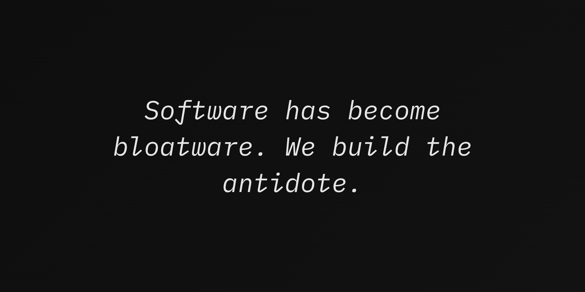

# Hey. Welcome to Firefly.
Firefly Labs is an independent technology lab focused on building
open-source tools, developer utilities, and experimental systems.

Our community is the ultimate guide for sucess.
**Code comes first. Hype does not.**

---

## What we do?
- Open-source software and tooling
- CLIs, TUIs, and terminal-focused projects
- Systems experimentation and infrastructure utilities
- Developer-first products with long-term intent

**Firefly** functions as an lab that hosts multiple independent projects.
Each repository is treated as a product, with clear goals and ownership.

Some projects are experimental. Some are stable. **All of them are real.**

  <table border="1" width="100%">
    <tr>
      <td align="center">
        
      </td>
    </tr>
  </table>

